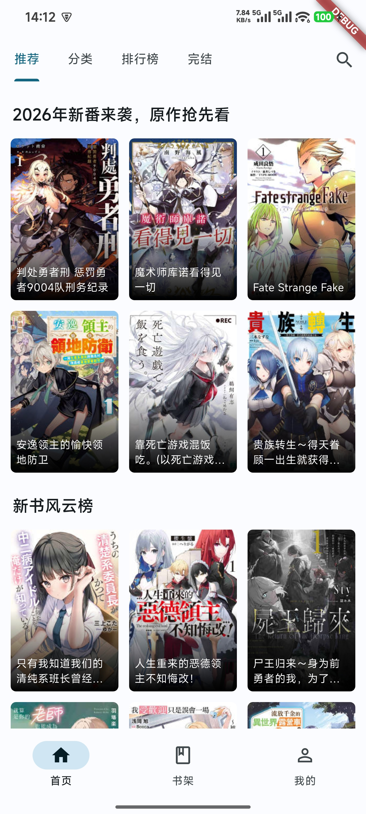
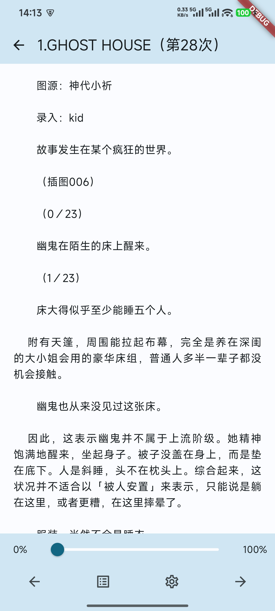

### 📣自0.2.0版本开始，本软件开始转为使用网页源，放弃了mewx源📣
### ⚠️我还要说明一点，如果你编译出来了，就自己用，不要发到其他地方。分享欲再旺盛也别发，你这是在害我们，老版的Hikari Novel就是一个例子。不要让我把这个项目也关停了，大家到时候都别用！⚠️

<hr>

<div align="center">

  <div align="center">
    
  </div>

# Hikari Novel

  <p align="center"><font>使用Flutter构建的第三方轻小说文库客户端</font></p>

  <div>
    
    
  </div>

</div>


## ✨ 功能
- Material Design 3风格
- 支持深浅模式切换
- 适配平板
- 支持章节缓存
- 支持查看评论与回复
- 阅读进度保存


## 📱 支持平台
| 平台      | 最小支持版本  | 备注                               |
|----------|-------------|------------------------------------|
| Android  | 6.0         | -                                  |
| iOS      | N/A         | 理论上支持，未测试                    |
| macOS    | N/A         | 理论上支持，未测试。未对键鼠操作进行适配  |
| Windows  | 10          | 未对键鼠操作进行适配，处于半可用状态     |
| Linux    | 不支持       | -                                  |
| Web      | 不支持       | -                                  |

注意️️：当iOS和macOS版本出问题时，我没办法修复，因为我没有苹果设备，所以仅保证安卓版能正常使用，但欢迎有能力的人士提PR


## 🖼️ 软件截图
- 手机
<div align="center">
  </img> </img> 
</div>

- 平板
<div align="center">
  </img> </img>
</div>


## ⛓️ 分支介绍
- `main` 主分支。发布版本用
- `develop` 开发分支。想要提pr的人请拉取这个分支进行开发，然后提pr时也请merge到这个分支


## 📦 安装
本项目不提供安装包，请参考下方 `编译` 自行编译使用


## 💻 编译
- ##### 我的开发环境
  ```
  [√] Flutter (Channel stable, 3.38.7, on Microsoft Windows [版本 10.0.26200.7840], locale zh-CN)
  [√] Windows Version (Windows 11 or higher, 25H2, 2009)
  [√] Android toolchain - develop for Android devices (Android SDK version 36.1.0)
  [√] Visual Studio - develop Windows apps (Visual Studio 生成工具 2026 18.2.0)
  ```
- ##### 编译
  1. 克隆此仓库
  2. 安装flutter，参考 [flutter.dev](https://flutter.dev/docs/get-started/install)
  3. 编译出对应平台的安装包，如 `flutter build apk`

## 🧑‍💻 交流
&nbsp;&nbsp;<a href="https://t.me/+CUSABNkX5U83NGNl"></a>


## 📣 声明
- 本项目是个人为了兴趣以及学习移动端开发而开发的，仅用于学习和测试
- 本项目所用API均从轻小说文库官方网站收集，不提供任何破解内容
- 本项目是个人项目，与轻小说文库官方无关，请注意辨别


## 📖 参考
- [flutter_dmzj](https://github.com/xiaoyaocz/flutter_dmzj)
- [venera](https://github.com/venera-app/venera)
- [mihon](https://github.com/mihonapp/mihon)
- [mikan_flutter](https://github.com/iota9star/mikan_flutter)
- [pilipala](https://github.com/guozhigq/pilipala)
- [PiliPalaX](https://github.com/orz12/PiliPalaX)
- [PiliPlus](https://github.com/bggRGjQaUbCoE/PiliPlus)
- AI

## ⭐ 星标数趋势
[](https://starchart.cc/15dd/hikari_novel_flutter)